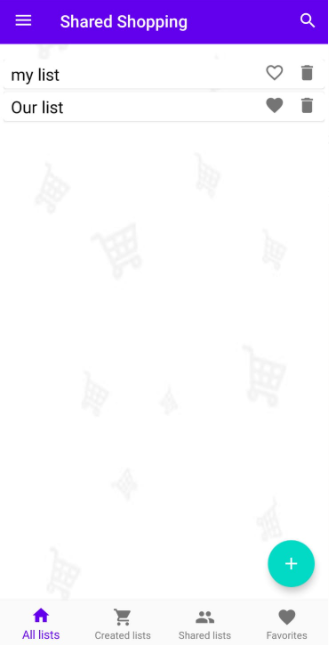
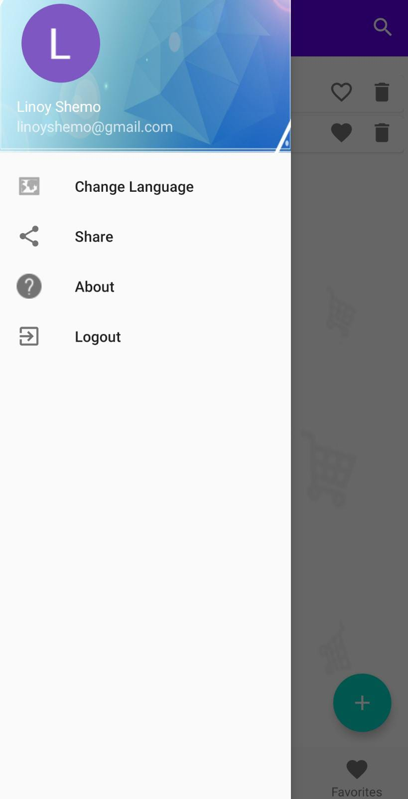

# SharedShopping
This project was done in partnership with [matan92]( https://github.com/matan92 ).

#### Techniques used:
- Java language
- NoSql database: Firebase
- Push notifications service
- Shared prefernces
- RecyclerView
- Several types of menus
- Activities and fragments

#### Fetures:
- Add lists and share them with friends by email address
- Add lists to favourites
- Edit user's profile
- Login with email address, Facebooj user or Gmail account.
- Change Language

#### Main Screen:

#### Menu:

